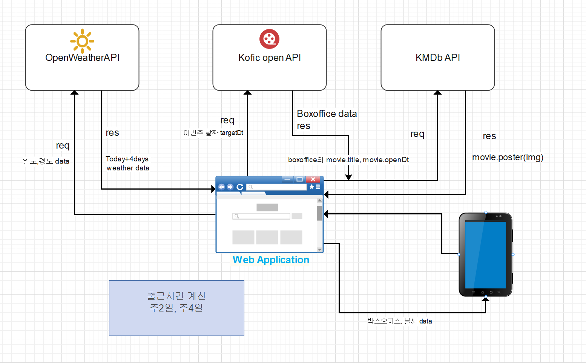

# cgv parttime web

이 프로젝트는 cgv 미소지기 아르바이트를 하며 알바생들의 출근시간 계산을 자동화시켜 지각률을 낮추고, 매니저들의
스케줄 작성에 도움을 주기 위해 개발하게 됐습니다.

## 아키텍쳐



## 실행 방법

1. 이 저장소를 클론합니다:

   ```bash
   git clone https://github.com/Hyun198/portfolio_partTime.git
   ```

2. 프로젝트 폴더로 이동합니다:

3. 필요한 패키지를 설치합니다:

   ```bash
   npm install
   ```

4. 웹을 실행시킵니다:

   `npm start`

## 현재 배포된 사이트

[CGV Part-time Job](https://cgvparttime.netlify.app/)
